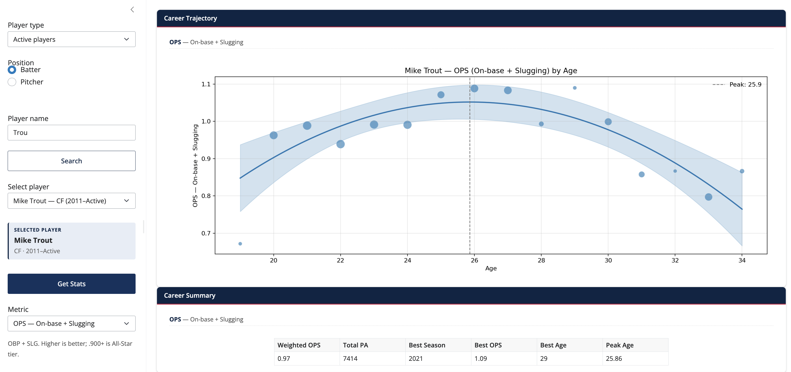

# Getting started

## Prerequisites

- Python 3.10 or newer.
- An internet connection (the first search downloads a season roster
  from the MLB Stats API).

## Install

Clone the repository and install in editable mode with the development
extras:

```bash
pip install -e ".[dev]"
```

## Run

Start the Shiny server:

```bash
baseball-trajectory
```

The app binds to `127.0.0.1:8000`. Open <http://127.0.0.1:8000> in a
browser.

## Your first trajectory

1. Leave **Player type** on *Active players* and **Position** on
   *Batter* (the defaults).
2. Type `Trout` in the **Player name** box. The dropdown populates
   with matches as you type — each row shows the player's position,
   e.g. *Mike Trout — CF (2011–Active)*.
3. Pick **Mike Trout** in the dropdown. A small info card appears
   confirming the pick (full name, position, debut–final seasons).
4. Click **Get Stats**. The trajectory plot, career summary, and
   season log fill in.
5. Try changing **Metric** from `OPS — On-base + Slugging` to `HR —
   Home runs` to see his home-run arc.

<figure markdown>
  { width="720" }
  <figcaption>The result of the first-trajectory walkthrough: scatter
  of seasons (size proportional to PA), the weighted-quadratic fit, a
  95% confidence ribbon, and a dashed line at the fitted peak age.</figcaption>
</figure>

### Looking up a retiree

Toggle **Player type** to *Retired players*, then type
e.g. `Griffey` or `Ryan`. The auto-typeahead window widens to ~50
seasons in this mode, so older retirees come up directly. If a name
still doesn't appear, click the **Search** button to do an even
deeper lookup. See the [User guide](user-guide.md) for the full
workflow.

## Stopping the server

Press `Ctrl-C` in the terminal where `baseball-trajectory` is running.

## Next

- Read the [User guide](user-guide.md) for the full sidebar walkthrough,
  including how to look up older retired players.
- See the [Deployment](deployment.md) page if you want to host the app
  yourself (Posit Connect Cloud, Docker, etc.).
