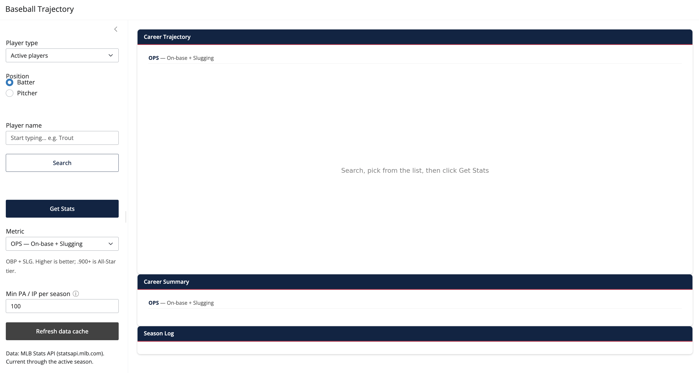

# baseball-trajectory

A small Shiny for Python app that fits and visualizes a single-metric
career aging curve for any major-league player.

Type a name in the sidebar, pick a stat — OPS (on-base + slugging),
ERA (earned run average), WHIP (walks + hits per inning pitched), and
so on — and the app fits a weighted quadratic to the per-season
values and renders the trajectory with a 95% confidence band and a
marked peak age.

<figure markdown>
  { width="960" }
  <figcaption>Sidebar controls on the left; trajectory plot, career
  summary, and season-log nanoplots on the right.</figcaption>
</figure>

## What you can do

- See when a player peaked, how steeply they declined, and how well a
  smooth curve fits across seasons.
- Compare a player on any of the metrics listed below.
- Look up active players via fast typeahead, or recently-retired
  players via a deeper search.
- Filter out cups-of-coffee seasons with the *Min PA / IP* knob
  (minimum plate appearances for batters or innings pitched for
  pitchers).

## The metrics

**For batters** (weighted by plate appearances):

- **OPS** — On-base + Slugging. The most-used single-number summary
  of offensive value.
- **OBP** — On-base percentage. How often the batter reaches base via
  hit, walk, or hit-by-pitch.
- **SLG** — Slugging percentage. Average bases gained per at-bat —
  measures power.
- **AVG** — Batting average. Hits per at-bat.
- **HR** — Home runs. Raw count per season.
- **ISO** — Isolated power. `SLG − AVG`; the pure extra-base
  component of power.

**For pitchers** (weighted by innings pitched):

- **ERA** — Earned run average. Earned runs allowed per nine
  innings. Lower is better.
- **WHIP** — Walks + Hits per Inning Pitched. Baserunners allowed
  per inning. Lower is better.
- **K/9** — Strikeouts per nine innings. Higher is better.
- **BB/9** — Walks per nine innings. Lower is better.
- **HR/9** — Home runs per nine innings. Lower is better.

See [Metrics](metrics.md) for formulas, benchmark ranges (what counts
as "elite" vs "average"), and the Min PA / IP threshold reference.

## When you might use it

- Quick exploration: *did Trout peak earlier than I thought?*
- Teaching: a worked example of weighted quadratic regression with a
  closed-form interpretation.
- A starting point for your own aging-curve work — the Polars career
  frames are usable from a notebook with
  `from baseball_trajectory.data import get_batting_career`.

## Where to go next

- [Getting started](getting-started.md) — install and run.
- [User guide](user-guide.md) — the full sidebar workflow.
- [Metrics](metrics.md) — definitions and benchmarks for every stat the app plots.
- [Modeling approach](modeling.md) — what the curve means.
- [Methods](methods.md) — worked example, similarity scores, multi-player comparison.
- [Deployment](deployment.md) — Posit Connect Cloud and other hosts.
- [API reference](reference.md) — programmatic usage.
