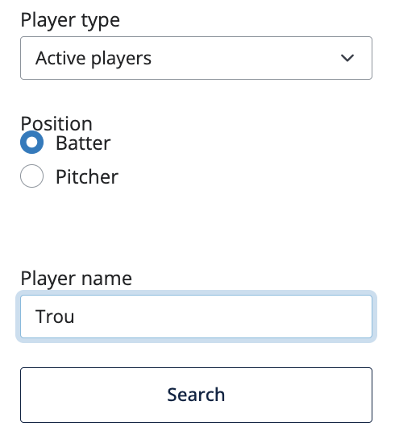
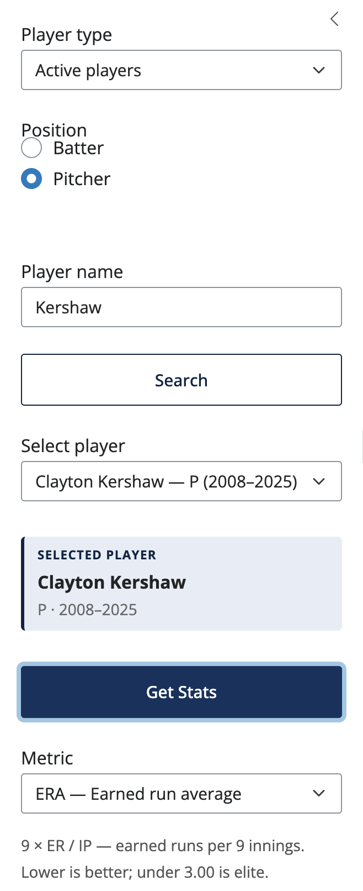
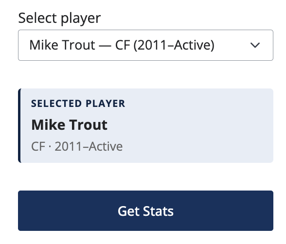
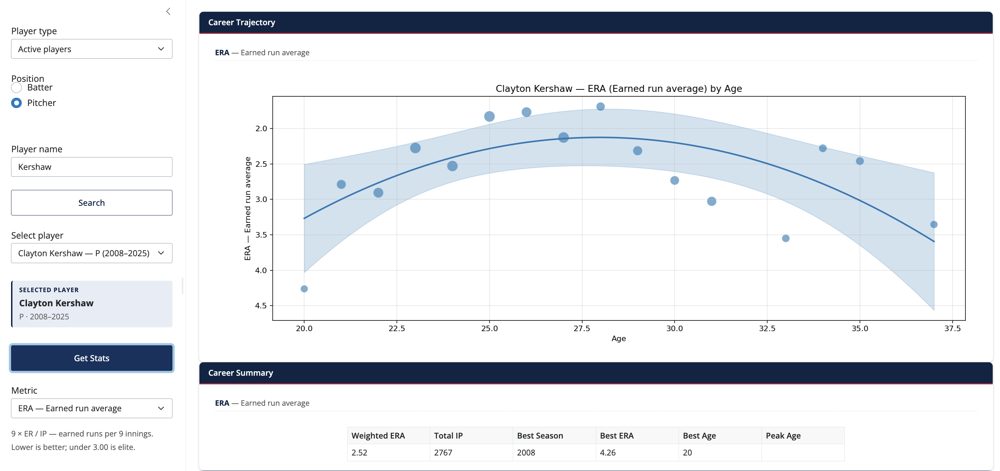
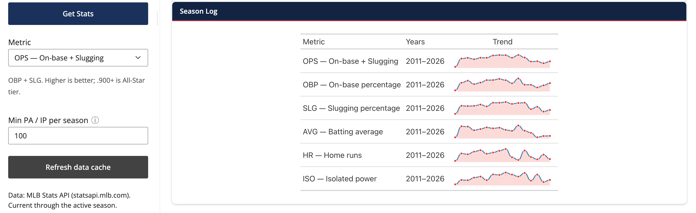

# User guide

The sidebar is set up as a two-step workflow: **find a player, then load
their stats.** Each step has its own button.

## 1. Tell the app what kind of player you want

Three controls at the top of the sidebar set the search scope and the
metric list:

| Control       | Choices                                      | What it does                                                                          |
| ------------- | -------------------------------------------- | ------------------------------------------------------------------------------------- |
| **Player type** | *Active players*, *Retired players*        | Sets how far back the player search reaches. *Active* uses a small 3-season window for instant typeahead; *Retired* widens to ~50 seasons so older retirees come up. |
| **Position**  | *Batter*, *Pitcher*                          | Swaps the metric list and the weight column used in the curve fit (PA for batters, IP for pitchers).                                                                  |
| **Metric**    | Batter or pitcher rate stats — see list below | Which stat to plot. Each dropdown option spells the acronym out, and a one-line definition appears below the dropdown when you change it. Full definitions, formulas, and benchmarks live on the [Metrics](metrics.md) page. |

The Metric dropdown swaps with **Position**:

| Position | Available metrics |
| -------- | ----------------- |
| **Batter**  | **OPS** (on-base + slugging), **OBP** (on-base percentage), **SLG** (slugging percentage), **AVG** (batting average), **HR** (home runs), **ISO** (isolated power; `SLG − AVG`) |
| **Pitcher** | **ERA** (earned run average; lower is better), **WHIP** (walks + hits per inning pitched; lower is better), **K/9** (strikeouts per 9 innings), **BB/9** (walks per 9 innings; lower is better), **HR/9** (home runs per 9 innings; lower is better) |

<figure markdown>
  { width="320" }
  <figcaption>The sidebar with the defaults: Active players, Batter,
  OPS. The inline help line under the Metric dropdown shows the
  formula and benchmark for the selected stat.</figcaption>
</figure>

## 2. Find a player

Type a name in the **Player name** box (≥2 characters). As you type,
the **dropdown below auto-populates** with matches — each row shows the
player's name, primary position, and debut–final seasons:

```
Mike Trout — CF (2011–Active)
Steve Trout — P (1978–1989)
```

That little position tag (`CF`, `P`, etc.) lets you confirm at a glance
that you're picking a player whose actual position matches the
**Position** toggle on the left.

### The dropdown is filtered by Position

To stop you from picking a position player while *Pitcher* is selected
(or vice versa), the dropdown is filtered by primary position:

| Position toggle | What you see in the dropdown                                 |
| --------------- | ------------------------------------------------------------ |
| **Batter**      | Every primary position except pure pitchers (`P`). Catchers, infielders, outfielders, DHs, and two-way players (`TWP`) all stay in. |
| **Pitcher**     | Only `P` (pure pitcher) and `TWP` (two-way players such as Ohtani). Position players are hidden. |

If your name search has matches but none survive the filter — e.g. you
searched *"Trout"* with *Pitcher* selected and only Mike Trout (CF)
came back — the picker shows a hint like *"No matching pitchers found.
Try a different name or switch Position to Batter."* Flipping the
**Position** toggle re-filters the existing search instantly without
re-querying the API.

<figure markdown>
  { width="320" }
  <figcaption>The sidebar with Position set to Pitcher. The Metric
  list switches to ERA / WHIP / K/9 / BB/9 / HR/9, and the dropdown
  filter only admits players whose primary position is P or TWP.</figcaption>
</figure>

### Looking up a retiree?

The auto-typeahead window depends on **Player type**:

- **Active players** — covers the current season + 3 prior seasons.
- **Retired players** — covers ~50 prior seasons (Griffey Jr.,
  Nolan Ryan, Pedro Martínez, etc. all show up).

If a retiree still doesn't appear (the auto window is capped to keep
typeahead fast), click the **Search** button. That triggers a deeper
lookup — up to ~80 seasons back in Retired mode — wide enough for
mid-century players like Bob Feller or Stan Musial.

!!! note "The first typeahead in Retired mode is slow"

    Switching to *Retired players* and typing your first name walks
    through ~50 seasonal rosters from the MLB Stats API. On a cold
    cache that takes 15–25 seconds; you'll see a top-of-page progress
    bar while it runs. Every subsequent keystroke is instant.

## 3. Confirm the pick

After the dropdown is populated, pick a row. A small **info card**
appears underneath with the player's name, primary position, and
debut–final seasons:

<figure markdown>
  { width="320" }
  <figcaption>Light-blue card under the picker showing the active
  selection. Reads SELECTED PLAYER, then the name, then the position
  and career-year range.</figcaption>
</figure>

This is your last chance to double-check the player matches the
**Position** toggle before loading stats. If the position shown there
disagrees with what you have on the left (e.g. you picked a
center-fielder while *Position: Pitcher* is selected), the app will
show a warning notification when you click Get Stats and the plot will
suggest switching the Position toggle.

## 4. Click Get Stats

Pressing **Get Stats** is what actually loads the trajectory plot, the
career summary, and the season log. Picking a name in the dropdown
alone doesn't trigger any work — that's deliberate, so the chart only
updates on an explicit commit and dropdown re-renders never thrash the
display.

## 5. Adjust filters (optional)

- **Min PA / IP per season** — drops noisy partial seasons before the
  curve is fit. Hover the **ⓘ** icon next to the label for the full
  explanation. Default is 100; raise it for true full-time players or
  lower it to include rookie debuts and injury years. See
  [Metrics → Min PA / IP per season](metrics.md#min-pa-ip-per-season)
  for the threshold reference table.
- **Refresh data cache** — clears the in-process roster and career
  caches. Useful when you've left the app running across a roster
  move or a new MLB game day.

## Reading the chart

- Each dot is one season; **dot size scales with playing time** (PA
  for batters, IP for pitchers).
- The solid curve is the **weighted quadratic fit**.
- The shaded ribbon is the **95% confidence band**.
- The dashed vertical line is the **fitted peak age** — only drawn
  when the quadratic is concave-down (i.e. a real peak exists).
- For pitcher rate metrics where lower is better — **ERA** (earned
  run average), **WHIP** (walks + hits per inning), **BB/9** (walks
  per 9 innings), and **HR/9** (home runs per 9 innings) — the y-axis
  is **inverted** so the peak is at the top of the chart.

<figure markdown>
  { width="720" }
  <figcaption>A batter trajectory. Dot size scales with PA; the
  curve is the weighted-quadratic fit; the dashed line marks the
  fitted peak age.</figcaption>
</figure>

<figure markdown>
  { width="720" }
  <figcaption>A pitcher trajectory on a lower-is-better metric. Note
  the inverted y-axis: lower ERA is up, so the fitted peak still
  visually sits at the top of the chart.</figcaption>
</figure>

## Reading the Career Summary

The one-row Career Summary table reports:

| Column                   | Meaning                                                           |
| ------------------------ | ----------------------------------------------------------------- |
| **Weighted *metric***    | The PA- or IP-weighted career average (rounded to two decimals).  |
| **Total PA / Total IP**  | Lifetime opportunity in the metric's natural unit.                |
| **Best Season**          | The single season with the highest (or for ERA/WHIP, best) value. |
| **Best *metric* / Age**  | Value and the player's age in the best season.                    |
| **Peak Age**             | The age the fitted quadratic peaks at (rounded to two decimals).  |

## Reading the Season Log

The Season Log shows one row per metric — not one row per season.
Each row contains a **nanoplot** ([great-tables][gt-nanoplot])
tracing the metric's year-by-year values across the player's career.
Use it to spot rise/peak/decline patterns at a glance without leaving
the page.

<figure markdown>
  { width="720" }
  <figcaption>One row per metric, each with an inline sparkline of
  year-by-year values. The Metric column spells out the acronym
  (e.g. "OPS — On-base + Slugging") so no scrolling back to the
  legend.</figcaption>
</figure>

[gt-nanoplot]: https://posit-dev.github.io/great-tables/reference/GT.fmt_nanoplot.html

## Switching to another player

1. Clear the **Player name** box and type the next name.
2. Pick the new player from the refreshed dropdown.
3. Click **Get Stats** again to commit.

The plot, summary, and season log all update to the newly committed
player. The previous player remains visible until you click Get
Stats, so you can browse search results without losing what you were
looking at.
